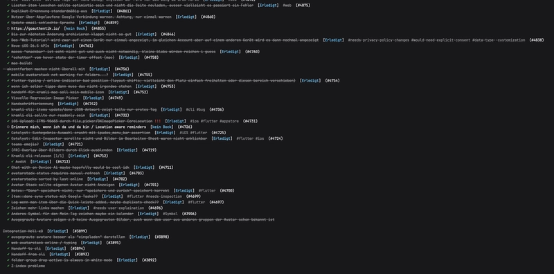

<p align="center">
  
</p>

<h1 align="center">kramli-cli</h1>

<p align="center">
  <strong>Command-line client for <a href="https://kramli.de">Kramli</a></strong><br>
  Shopping lists, todos, and shared lists <i>>_</i> managed from your terminal.
</p>

<p align="center">
  <a href="https://app.deepsource.com/gh/SpotlightForBugs/kramli-cli/">
    
  </a>
  <a href="https://app.deepsource.com/gh/SpotlightForBugs/kramli-cli/">
    
  </a>
  <a href="https://github.com/SpotlightForBugs/kramli-cli/releases/latest">
    
  </a>
  <a href="LICENSE">
    
  </a>
</p>


<p align="center">
  
</p>

<p align="center">
  
</p>

## Install

**Homebrew (macOS and Linux)**

```bash
brew install SpotlightForBugs/tap/kramli
brew trust --formula spotlightforbugs/tap/kramli
```

**Install script (macOS, Linux, Windows via WSL)**

```bash
curl --proto '=https' --tlsv1.2 -LsSf https://github.com/SpotlightForBugs/kramli-cli/releases/latest/download/kramli-installer.sh | sh
```

**Windows (PowerShell)**

```powershell
irm https://github.com/SpotlightForBugs/kramli-cli/releases/latest/download/kramli-installer.ps1 | iex
```

Or download a build for your platform from [Releases](https://github.com/SpotlightForBugs/kramli-cli/releases), extract `kramli`, and put it on your `PATH`.

## Quick start

```bash
kramli login
kramli lists list
kramli items list <LIST_ID> --open
kramli items list <LIST_ID> --open --newest --limit 11
kramli items add <LIST_ID> "Milk" --priority high
kramli lists create "Notizzettel" --type note --note-content "# Ideen\n- [ ] Termin"
kramli lists update <LIST_ID> --note-content "# Notiz\nAktualisiert"
kramli search "dark mode"
```

### Interactive mode

Use interactive mode if you want a terminal UI:

```bash
kramli -i
```

Controls:

```text
q              quit
Tab / Shift+Tab switch mode (list / board / calendar)
1, 2, 3        switch mode directly
Arrow keys     move selection
Enter          load list (left pane) or open editor (right pane)
e              open item editor
Ctrl+S         save in editor
Space          toggle done for selected item
r              refresh lists/items
Mouse click    tabs, lists, cards, calendar rows, action buttons, editor controls
```

Notes:

- If an item has an image, the details pane renders an inline terminal preview when the terminal protocol supports it.
- On unsupported terminals, the app falls back gracefully and keeps item details fully usable.
- The TUI uses readable text labels for actions and list icons.
- The TUI footer shows the active shortcut for each action.
- Remap a TUI action with `KRAMLI_TUI_KEY_<ACTION>`, for example `KRAMLI_TUI_KEY_ADD=n kramli -i`.
- Supported key values include single characters, `space`, `enter`, `esc`, `tab`, `f1`, and modifiers such as `ctrl+x`.
- Viewing a list sends the cross-device handoff automatically. Manual handoff is also available with `kramli handoff`.
- Image protocol detection runs automatically; no user setup is required.
- Force a specific inline image protocol with `KRAMLI_TUI_IMAGE_PROTOCOL`:
  - `imgcat` / `iterm2`
  - `kitty`
  - `sixel`
  - `halfblocks`
  - `auto` (default) or `off`
- Inline Bootstrap icon color follows `KRAMLI_TUI_THEME=light|dark` or `KRAMLI_TUI_ICON_COLOR=#1f4f8f`.
- Bootstrap list icons are loaded only after you approve the first-run prompt. Override with `KRAMLI_BOOTSTRAP_ICONS=1` or `KRAMLI_BOOTSTRAP_ICONS=0`.

Create an API key at [kramli.de/settings#api-keys](https://kramli.de/settings#api-keys) if you prefer `kramli login --api-key`.

## Localization

- Default/fallback language is English (`en`).
- Locale priority: `KRAMLI_LANG` -> profile language (`/api/profile.lang`) -> `LC_ALL` -> `LC_MESSAGES` -> `LANG` -> `en`.
- Supported language codes: `en`, `de`, `fr`, `es`, `it`, `nl`, `pl`, `pt`, `ru`, `tr`, `uk`, `ar`, `ja`, `ko`, `zh`.
- Icon style for terminal output: `KRAMLI_ICON_STYLE=label` (default), `emoji`, or `raw`.

Examples:

```bash
KRAMLI_LANG=de kramli status
KRAMLI_LANG=fr kramli lists list
KRAMLI_LANG=pt_BR kramli profile
KRAMLI_ICON_STYLE=emoji kramli lists list
```

Check for a new CLI release manually:

```bash
kramli update-check
```

Enable automatic daily update checks (disabled by default):

```bash
KRAMLI_AUTO_UPDATE_CHECK=1 kramli status
```

On first interactive use, Kramli asks two quick questions:

- Send anonymous crash and hang reports? This helps catch broken releases. Reports are scrubbed before sending and do not include OS usernames, IP addresses, hostnames, request bodies, or API credentials.
- Load Bootstrap list icons in the TUI? If enabled, the TUI may fetch SVG icons from `https://icons.getbootstrap.com`.

Your answers are saved locally. Machine-readable commands such as `--json`, `batch`, `mcp`, and completions never stop for prompts.

You can also override the saved choices with environment variables:

- Enable crash and hang reports: `KRAMLI_TELEMETRY=1`
- Disable crash and hang reports: `KRAMLI_TELEMETRY=0`, `KRAMLI_NO_TELEMETRY=1`, or `DO_NOT_TRACK=1`
- Enable Bootstrap icons: `KRAMLI_BOOTSTRAP_ICONS=1`
- Disable Bootstrap icons: `KRAMLI_BOOTSTRAP_ICONS=0`

Example:

```bash
KRAMLI_TELEMETRY=0 kramli status
```

Boolean env vars accept `1`, `true`, `on`, or `yes` to enable and `0`, `false`, `off`, or `no` to disable. Bootstrap icons also support the aliases `KRAMLI_TUI_BOOTSTRAP_ICONS` and `KRAMLI_LOAD_BOOTSTRAP_ICONS`.

## License

MIT
